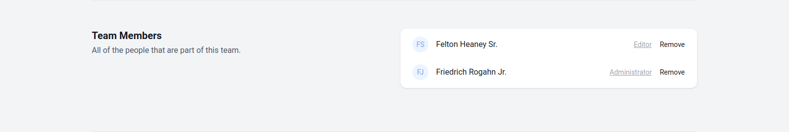

# FilamentJet

[](https://packagist.org/packages/artmin96/filament-jet)
[](https://github.com/artmin96/filament-jet/actions?query=workflow%3Arun-tests+branch%3Amain)
[](https://github.com/artmin96/filament-jet/actions?query=workflow%3A"Check+%26+fix+styling"+branch%3Amain)
[](https://packagist.org/packages/artmin96/filament-jet)


> This package is basically a fusion of [Jetstream](https://github.com/laravel/jetstream) and [Filament Breezy](https://github.com/jeffgreco13/filament-breezy) with a few added features.

There was a case when something from [Filament Breezy](https://github.com/jeffgreco13/filament-breezy) needed something from [Jetstream](https://github.com/laravel/jetstream), or to add other features to them, and I decided to create this plugin to bring them all together.

Filament Jet is a authentication starter kit for [Filament](https://github.com/filamentphp/filament) and provides the perfect starting point for your next [Filament](https://github.com/filamentphp/filament) application. Filament Jet provides the implementation for your application's login, registration, email verification, two-factor authentication, session management, personal data export, API via Laravel Sanctum, and optional team management features.

Switchable team             |  User menu
:--------------------------:|:-------------------------:
  |  

## Installation

> **Warning**
> Attempting to install Filament Jet into an existing Filament application will result in unexpected behavior and issues.

You can install the package via composer:

```bash
composer require artmin96/filament-jet
```

After installing the Filament Jet package, you may execute the following Artisan command.

```bash
php artisan filament-jet:install
```

In addition, you may use the `--teams` switch to enable team support.

After installing Filament Jet, you should migrate your database:

```bash
php artisan migrate
```

Optionally, you can publish the views using

```bash
php artisan vendor:publish --tag="filament-jet-views"
```

This is the contents of the published config file:

```php
return [
];
```

## Teams

If you installed Filament Jet using the `--teams` option, your application will be scaffolded to support team creation and management.

### Create Team


### Team Settings





### Disabling team feature

If you want to disable the team feature, remove this line from the `config/filament-jet.php` config.

```php
Features::teams([
    'invitations' => false,
    'middleware' => []
])
```

### Invitations

By default, Filament Jet will simply add any existing application user that you specify to your team.
To get started, pass the `invitations` option when enabling the "teams" feature for your application. This may be done by modifying the `features` array of your application's `config/filament-jet.php` configuration file.

## Email Verification

To get started, verify that your `App\Models\User` model implements the `Illuminate\Contracts\Auth\MustVerifyEmail` contract

```php
use Illuminate\Contracts\Auth\MustVerifyEmail;
use Illuminate\Foundation\Auth\User as Authenticatable;

class User extends Authenticatable implements MustVerifyEmail
{
    // ...
}
```

## Usage

The `filament-jet` configuration file contains a features configuration array where you can enable or disable the feature you want.

## Testing

```bash
composer test
```

## Changelog

Please see [CHANGELOG](CHANGELOG.md) for more information on what has changed recently.

## Contributing

Please see [CONTRIBUTING](.github/CONTRIBUTING.md) for details.

## Security Vulnerabilities

Please review [our security policy](../../security/policy) on how to report security vulnerabilities.

## Credits

- [Arthur Minasyan](https://github.com/ArtMin96)
- [All Contributors](../../contributors)

This package was inspired by a package by [jeffgreco13](https://github.com/jeffgreco13) and [Laravel's jetstream](https://github.com/laravel/jetstream).

## License

The MIT License (MIT). Please see [License File](LICENSE.md) for more information.
