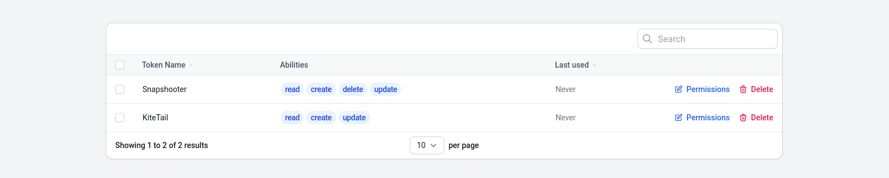

# FilamentJet

[](https://packagist.org/packages/artmin96/filament-jet)
[](https://github.com/artmin96/filament-jet/actions?query=workflow%3Arun-tests+branch%3Amain)
[](https://github.com/artmin96/filament-jet/actions?query=workflow%3A"Check+%26+fix+styling"+branch%3Amain)
[](https://packagist.org/packages/artmin96/filament-jet)


> This package is basically a fusion of [Jetstream](https://github.com/laravel/jetstream) and [Filament Breezy](https://github.com/jeffgreco13/filament-breezy) with a few added features.

There was a case when something from [Filament Breezy](https://github.com/jeffgreco13/filament-breezy) needed something from [Jetstream](https://github.com/laravel/jetstream), or to add other features to them, and I decided to create this plugin to bring them all together.

Filament Jet is a authentication starter kit for [Filament](https://github.com/filamentphp/filament) and provides the perfect starting point for your next [Filament](https://github.com/filamentphp/filament) application. Filament Jet provides the implementation for your application's login, registration, email verification, two-factor authentication, session management, personal data export, API via Laravel Sanctum, and optional team management features.

Switchable team             |  User menu
:--------------------------:|:-------------------------:
  |  

## Installation

> **Warning**
> Attempting to install Filament Jet into an existing Filament application will result in unexpected behavior and issues.

You can install the package via composer:

```bash
composer require artmin96/filament-jet
```

After installing the Filament Jet package, you may execute the following Artisan command.

```bash
php artisan filament-jet:install
```

In addition, you may use the `--teams` switch to enable team support.

After installing Filament Jet, you should migrate your database:

```bash
php artisan migrate
```

Optionally, you can publish the views using

```bash
php artisan vendor:publish --tag="filament-jet-views"
```

Update the `config/filament.php` to point to the Filament Jet's `Login::class`.

```php
'auth' => [
    'guard' => env('FILAMENT_AUTH_GUARD', 'web'),
    'pages' => [
        'login' => \ArtMin96\FilamentJet\Http\Livewire\Auth\Login::class,
    ],
],
```

## Profile Management

Filament Jet's profile management features are accessed by the user using the top-right user profile navigation dropdown menu. Filament Jet actions that allow the user to update their name, email address, and, optionally, their profile photo.


You may want to disable the `updateProfileInformation` feature by adding a comment.

```php
use ArtMin96\FilamentJet\Features;

'features' => [
    // Features::updateProfileInformation(),
],
```

### Enabling Profile Photos

If you wish to allow users to upload custom profile photos, you must enable the feature in your application's `config/filament-jet.php` configuration file. To enable the feature, simply uncomment the corresponding feature entry from the `features` configuration item within this file:

```php
use ArtMin96\FilamentJet\Features;

'features' => [
    Features::profilePhotos(),
],
```

Follow the link for more information: [Jetstream Profile Management](https://jetstream.laravel.com/2.x/features/profile-management.html)

### Password Update

You may want to disable the `updatePasswords` feature by adding a comment.

```php
use ArtMin96\FilamentJet\Features;

'features' => [
    // Features::updatePasswords(),
],
```

You may want to update the password without filling in the current password.

```php
'profile' => [
    // ...

    'require_current_password_on_change_password' => false,
],
```

### Two Factor Authentication

When a user enables two-factor authentication for their account, they should scan the given QR code using a free TOTP authenticator application such as Google Authenticator. In addition, they should store the listed recovery codes in a secure password manager such as [1Password](https://1password.com/).

You may want to disable the `twoFactorAuthentication` feature by adding a comment.

```php
use ArtMin96\FilamentJet\Features;

'features' => [
//     Features::twoFactorAuthentication([
//        'confirm' => true,
//        'confirmPassword' => true,
//    ]),
],
```

### Browser Sessions

This feature utilizes Laravel's built-in `Illuminate\Session\Middleware\AuthenticateSession` middleware to safely log out other browser sessions that are authenticated as the current user.

> **Note**
> To utilize browser session management within Filament Jet, ensure that your session configuration's `driver` (or `SESSION_DRIVER` environment variable) is set to 'database'.

You may want to disable the `logoutOtherBrowserSessions` feature by adding a comment.

```php
use ArtMin96\FilamentJet\Features;

'features' => [
    // Features::logoutOtherBrowserSessions(),
],
```

### Delete Account

You may want to disable the `accountDeletion` feature by adding a comment.

```php
use ArtMin96\FilamentJet\Features;

'features' => [
    // Features::accountDeletion(),
],
```

### Download Your Information

You can download a copy of your information from your profile. Once your files are available, you can download them to your device.

You may want to disable the `personalDataExport` feature by adding a comment.

```php
use ArtMin96\FilamentJet\Features;

'features' => [
    // Features::personalDataExport([
    //    'export-name' => 'personal-data',
    //    'add' => [
            // ['nameInDownload' => '', 'content' => []]
    //    ],
    //    'add-files' => [
            // ['pathToFile' => '', 'diskName' => '', 'directory' => '']
    //    ],
    // ]),
],
```

- `add`: the first parameter is the name of the file in the inside the zip file. The second parameter is the content that should go in that file. If you pass an array here, we will encode it to JSON.
- `add-file`: the first parameter is a path to a file which will be copied to the zip. You can also add a disk name as the second parameter.

The `export-name` will only affect the name of the download that will be sent as a response to the user, not the name of the zip stored on disk.

This uses the [spatie/laravel-personal-data-export](https://github.com/spatie/laravel-personal-data-export) package. Follow the link for other information.

## Teams

If you installed Filament Jet using the `--teams` option, your application will be scaffolded to support team creation and management.

### Create Team


### Team Settings


### Disabling team feature

If you want to disable the team feature, remove this line from the `config/filament-jet.php` config.

```php
use ArtMin96\FilamentJet\Features;

'features' => [
    Features::teams([
        'invitations' => false,
        'middleware' => []
    ])
],
```

If you want to add other middlewares, fill in the middleware array.

Follow the link for more information: [Jetstream Teams](https://jetstream.laravel.com/2.x/features/teams.html)

### Invitations

By default, Filament Jet will simply add any existing application user that you specify to your team.
To get started, pass the `invitations` option when enabling the "teams" feature for your application. This may be done by modifying the `features` array of your application's `config/filament-jet.php` configuration file.

Follow the link for more information: [Jetstream Teams](https://jetstream.laravel.com/2.x/features/teams.html)

## API





Laravel Sanctum provides a featherweight authentication system for SPAs (single page applications), mobile applications, and simple, token-based APIs. Sanctum allows each user of your application to generate multiple API tokens for their account. These tokens may be granted abilities / permissions which specify which actions the tokens are allowed to perform.

### Enabling API Support

If your application will be offering an API that may be consumed by third-parties, you must enable Filament Jet's API feature. To do so, you should uncomment the relevant entry in the `features` configuration option of your application's `config/filament-jet.php` configuration file:

```php
use ArtMin96\FilamentJet\Features;

'features' => [
    Features::api()
],
```

Follow the link for more information: [Jetstream API](https://jetstream.laravel.com/2.x/features/api.html)

## Authentication

### Registration


#### Requiring Terms Of Service / Privacy Policy Approval

Many applications require users to accept their terms of service / privacy policy during registration. Filament Jet allows you to easily enable this requirement for your own application, as well as provides a convenient way of writing these documents using Markdown.

To get started, enable this feature in your application's `config/filament-jet.php` configuration file:

```php
use ArtMin96\FilamentJet\Features;

'features' => [
    Features::termsAndPrivacyPolicy(),
],
```

Next, you may write your terms of service / privacy policy documents by modifying your application's `resources/markdown/terms.md` and `resources/markdown/policy.md` files.

#### Disabling Registration Feature

You may want to disable the `registration` feature by adding a comment.

```php
use ArtMin96\FilamentJet\Features;

'features' => [
    // Features::registration([
    //     'component' => \ArtMin96\FilamentJet\Http\Livewire\Auth\Register::class,
    //     'terms_of_service' => \ArtMin96\FilamentJet\Http\Livewire\TermsOfService::class,
    //     'privacy_policy' => \ArtMin96\FilamentJet\Http\Livewire\PrivacyPolicy::class,
    //     'auth_card_max_w' => null,
    // ]),
],
```

### Login


### Reset Password


#### Disabling Reset Password Feature

You may want to disable the `resetPasswords` feature by adding a comment.

```php
use ArtMin96\FilamentJet\Features;

'features' => [
    Features::resetPasswords([
        'component' => \ArtMin96\FilamentJet\Http\Livewire\Auth\ResetPassword::class,
    ]),
],
```

### Extending and Overriding Components

All pages within the auth flow are full-page Livewire components made to work with Filament Forms. So you can easily extend any component to add your own fields and actions.

You may want to change the registration component:

```php
use ArtMin96\FilamentJet\Features;

'features' => [
    Features::registration([
        'component' => YourRegistrationComponent::class,
        // ...
    ]),
],
```

You may want to change the terms of service or privacy policy component:

```php
use ArtMin96\FilamentJet\Features;

'features' => [
    Features::registration([
        // ...
        'terms_of_service' => YourTermsOfServiceComponent::class,
        'privacy_policy' => YourPrivacyPolicyComponent::class,
        // ...
    ]),
],
```

You may want to change the reset password component:

```php
use ArtMin96\FilamentJet\Features;

'features' => [
    Features::resetPasswords([
        'component' => YourResetPasswordComponent::class,
    ]),
],
```

## Email Verification

To get started, verify that your `App\Models\User` model implements the `Illuminate\Contracts\Auth\MustVerifyEmail` contract

```php
use Illuminate\Contracts\Auth\MustVerifyEmail;
use Illuminate\Foundation\Auth\User as Authenticatable;

class User extends Authenticatable implements MustVerifyEmail
{
    // ...
}
```

## Usage

The `filament-jet` configuration file contains a features configuration array where you can enable or disable the feature you want.

## Testing

```bash
composer test
```

## Changelog

Please see [CHANGELOG](CHANGELOG.md) for more information on what has changed recently.

## Contributing

Please see [CONTRIBUTING](.github/CONTRIBUTING.md) for details.

## Security Vulnerabilities

Please review [our security policy](../../security/policy) on how to report security vulnerabilities.

## Credits

- [Arthur Minasyan](https://github.com/ArtMin96)
- [All Contributors](../../contributors)

This package was inspired by a package by [jeffgreco13](https://github.com/jeffgreco13) and [Laravel's jetstream](https://github.com/laravel/jetstream).

## License

The MIT License (MIT). Please see [License File](LICENSE.md) for more information.
